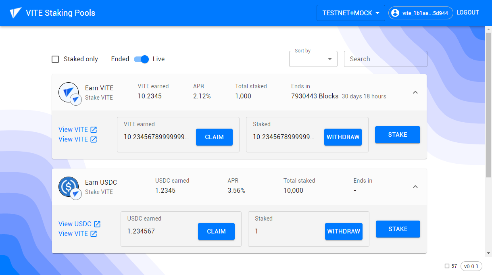

# vite-staking

Staking pools distribute a chosen native Vite token as a reward to users staking another chosen native Vite token. The total reward rate is fixed, and staking users earn rewards proportional to the amount they stake. Contract can be found [here](https://github.com/weserickson/vite-staking-pools).

<h1 align="center">
	
</h1>

## Setup

First, download & install [Node](https://nodejs.org/en/) v14+ and [Yarn](https://yarnpkg.com/getting-started/install).

To install all dependencies just run the following command in the `app` folder:

```bash
yarn install
```

- create .env file based on [.env.example](./app/.env.example)

### Start

Starts the client at http://localhost:3000

```bash
yarn start
```

### GraphQL codegen

This command has to be executed whenever the GraphQL scheme changes.

```bash
yarn codegen
```

### Build

Builds the client into `build` folder.

```bash
yarn build
```

### Test

```bash
yarn test
```

## Notes

Sample response from getPoolInfo:

```js
[
  'tti_5649544520544f4b454e6e40', // stakingTokenId
  'tti_5649544520544f4b454e6e40', // rewardTokenId
  '1000000000000000000', // totalStakingBalance
  '10000000000000000000', // totalRewardBalance
  '7922500', // startBlock
  '7930500', // endBlock
  '7922500', // latestRewardBlock
  '1250000000000000', // rewardPerPeriod
  '0', // rewardPerToken
  '0' // paidOut
]
```

Sample response from getUserInfo:

```js
[ 
  '1000000000000000000', // stakingBalance
  '0' // rewardDebt
]
```

Get token information from ViteX API

https://vitex.vite.net/api/v1/token/detail?tokenId=tti_5649544520544f4b454e6e40

```json
{
    "code": 0,
    "msg": "ok",
    "data": {
        "tokenId": "tti_5649544520544f4b454e6e40",
        "name": "VITE",
        "symbol": "VITE",
        "originalSymbol": "VITE",
        "totalSupply": "1023020137199357914813224782",
        "publisher": "vite_0000000000000000000000000000000000000004d28108e76b",
        "tokenDecimals": 18,
        "tokenAccuracy": "0.000000000000000001",
        "publisherDate": 1558411200,
        "reissue": 1,
        "urlIcon": "https://token-profile-1257137467.cos.ap-hongkong.myqcloud.com/icon/e6dec7dfe46cb7f1c65342f511f0197c.png",
        "gateway": {
            "name": "Vite Gateway",
            "icon": null,
            "policy": {
                "en": "https://x.vite.net/viteLabsGatePrivacy.html"
            },
            "overview": {
                "en": "Vite Gateway runs cross-chain services for four coins: BTC, ETH, USDT(ERC20)",
                "zh": "Vite Gateway runs cross-chain services for four coins: BTC, ETH, USDT(ERC20)"
            },
            "links": {
                "website": [
                    "https://vite.org"
                ],
                "whitepaper": [
                    "https://github.com/vitelabs/whitepaper/"
                ],
                "explorer": [
                    "https://explorer.vite.net"
                ],
                "email": [
                    "gateway@vite.org"
                ]
            },
            "support": "gateway@vite.org",
            "serviceSupport": "https://vitex.zendesk.com/hc/en-001/requests/new",
            "isOfficial": false,
            "level": 0,
            "website": "https://vite.org",
            "mappedToken": {
                "symbol": "VITE",
                "name": "ViteToken",
                "tokenCode": "1564",
                "platform": "ETH",
                "tokenAddress": "0xadd5E881984783dD432F80381Fb52F45B53f3e70",
                "standard": "ERC20",
                "url": "https://crosschain.vite.net/gateway/eth",
                "tokenIndex": null,
                "icon": "https://token-profile-1257137467.cos.ap-hongkong.myqcloud.com/icon/e6dec7dfe46cb7f1c65342f511f0197c.png",
                "decimal": 18,
                "mappedTokenExtras": [
                    {
                        "symbol": "VITE",
                        "name": null,
                        "tokenCode": "1588",
                        "platform": "BSC",
                        "tokenAddress": "0x2794dad4077602ed25a88d03781528d1637898b4",
                        "standard": "BEP20",
                        "url": "https://crosschain.vite.net/gateway/bsc",
                        "tokenIndex": null,
                        "icon": "https://token-profile-1257137467.cos.ap-hongkong.myqcloud.com/icon/e6dec7dfe46cb7f1c65342f511f0197c.png",
                        "decimal": 18,
                        "mappedTokenExtras": null
                    }
                ]
            },
            "url": "https://crosschain.vite.net/gateway/eth"
        },
        "links": {
            "youtube": [
                "https://www.youtube.com/channel/UC8qft2rEzBnP9yJOGdsJBVg"
            ],
            "forum": [
                "https://forum.vite.net/"
            ],
            "website": [
                "https://vite.org/"
            ],
            "github": [
                "https://github.com/vitelabs"
            ],
            "twitter": [
                "https://twitter.com/vitelabs/"
            ],
            "whitepaper": [
                "https://github.com/vitelabs/whitepaper"
            ],
            "discord": [
                "https://discordapp.com/invite/CsVY76q/"
            ],
            "facebook": [
                "https://www.facebook.com/vitelabs/"
            ],
            "explorer": [
                "https://explorer.vite.net/",
                "https://vitescan.io/"
            ],
            "reddit": [
                "https://www.reddit.com/r/vitelabs/"
            ],
            "medium": [
                "https://medium.com/vitelabs/"
            ],
            "instagram": [
                "https://www.instagram.com/vite.labs/"
            ]
        },
        "overview": {
            "en": "Vite describes itself as a public chain designed to provide a fast and feeless payment network and low-cost dApp platform for use in enterprise-grade applications. Vite uses a Directed Acyclic Graph (DAG) architecture with delegated Proof-of-Stake consensus algorithm. To reduce the security risks associated with DAG, Vite incorporates its Snapshot Chain technology."
        }
    }
}
```